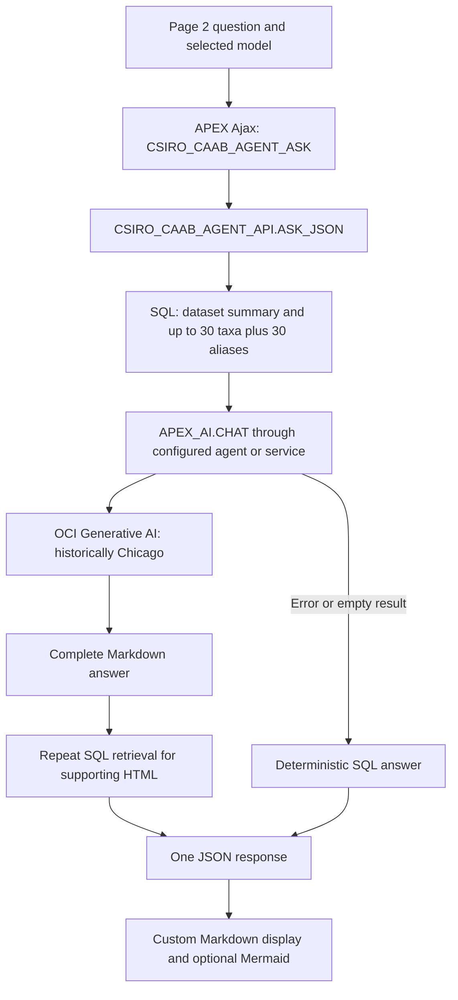

# CAAB performance and AI review

**17 September 2026 · Recommendation only · Owner: this CAAB review task · Implementation decision: Paul Ashcroft**

## Decision summary

Prioritize reliable model selection, honest fallback messages and correct SQL retrieval before changing infrastructure or choosing a larger model. The reviewed source attempts AI for every question and, when AI succeeds, repeats retrieval to build supporting details. Exact catalogue questions can instead return authoritative SQL results immediately, with AI reserved for explanation.

There are two particularly concrete findings:

1. **The live feedback configuration still targets ASHCROFT project `afma`.** The live AI Hub registry identifies this application as AIDEMODB project `caab`. Forwarding needs its separately approved migration; it must not be activated by replaying the historical script.
2. **The saved search logic misses a real CAAB code.** A SELECT-only reproduction against live data missed Mulloway code `37354001`, although an exact lookup finds it. The same source accepts unrelated NSW aliases for a “tuna NSW” question. Improve retrieval before measuring model quality.

The July application export also includes two Cohere model aliases retired by Oracle on 30 July. That establishes a compatibility problem **if those choices remain installed**; current workspace AI service definitions could not be read. [Oracle retirement notice](https://docs.oracle.com/en-us/iaas/releasenotes/generative-ai/cohere-command-model-aliases-retired.htm)

The measured database subset was responsive: summary metrics took **174–278 ms**, status totals **71–72 ms**, and an exact species lookup **42–46 ms**, with two executions each. These are SQLcl client elapsed times, including database/network/fetch overhead. They do not establish browser latency, AI latency, concurrency behavior or a p95. No model call or business-writing flow was exercised.

**Recommendation:** approve a small CAAB reliability and retrieval package after its current deployed components are reconciled with the saved source. Defer vector search, extra agents, dedicated inference infrastructure and a broad UI rewrite. Implementation awaits Paul's approval.

## Target, provenance and confidence

Evidence labels used throughout:

- **Live:** read from AIDEMODB during this review.
- **Source:** inspected in the saved checkout; deployed package-body equivalence is unverified.
- **Historical:** earlier export or runbook verification, not a current health test.
- **Hypothesis/proposal:** requires measurement or implementation-stage validation.

| Item | Verified position |
|---|---|
| Database connection | Discovered SQLcl alias `aidemodb`, user `CODEX`; database `GE1C42BF10AE843_AIDEMODB`, medium service in Sydney. No ADMIN/SYS login. CODEX has existing broad grants including `SELECT ANY TABLE` and `EXECUTE ANY PROCEDURE`; this is not a dedicated read-only account. Only scoped reads and session-context attempts were used. |
| Database/APEX release | **Live:** Oracle AI Database 26ai Enterprise Edition `23.26.3.3.0`; APEX **26.1.4**. ORDS release not verified. |
| Registered application identity | **Live `AIHUB.HUB_PROJECTS`:** `caab`, ACTIVE, workspace/schema `AFMA`/`AFMA`, application `101`, `AFMA CAAB AI Demo`, alias `AFMA-CAAB-AI-DEMO`; registry updated 28 July 2026. This proves the current registry mapping, not the current deployed application definition. |
| Documented runtime | [CAAB home](https://ge1c42bf10ae843-aidemodb.adb.ap-sydney-1.oraclecloudapps.com/ords/r/afma/afma-caab-ai-demo/home). Authenticated runtime not tested in this review. |
| Reviewed saved checkout | `C:/Users/pashcrof/Documents/Codex Projects/AFMA Demos`, commit `3eb70349f93bf4e94abeb27ebd5e1d73b6adeddd`, 10 September 2026, “fix: protect AFMA task-owned output (ai-hub-011)”. Existing modified `.gitignore` and untracked `_gitignore_for_mac_migration` preserved. |
| Review worktree | `C:/Users/pashcrof/.codex/worktrees/1d21/AFMA Demos`, detached HEAD `e0896006fb3485e57633b7c0190be3a5c53898ba`, 11 June onboarding shell. It omits substantial later source. The report therefore cites the saved checkout, not the old worktree as current application source. |
| Latest saved app checkpoint | APEXlang Standard Export dated **15 July 2026**. Its application compatibility mode is `24.2`; that is distinct from the live APEX engine release. June SQL exports identify earlier APEX `24.2.16`. |
| Deployed source drift | Live package specifications and views are visible; package bodies are not visible through `ALL_SOURCE`. Three source bodies could not be compared. Several view modification dates are 13 July; package specification dates are 11–12 June. Dates alone do not prove body equivalence. |

### Precise access limits

SQLcl `26.2.0.0`, build `26.2.0.181.2110`, was verified at the prescribed executable. The sandbox Java startup failed; the supported normal-user execution succeeded without runtime changes. Saved aliases were discovered before use: `aidemodb` (`CODEX`) and `aidemodb-workshops` (`WORKSHOPS`). The unrelated WORKSHOPS identity was not used.

`APEX_APPLICATIONS` and `APEX_WORKSPACES` did not expose AFMA/app 101 in this CODEX session. `APEX_UTIL.FIND_SECURITY_GROUP_ID('AFMA')` returned null. `SET_WORKSPACE('AFMA')` did not establish visible application metadata. The workspace ID from the old export, `14392040298408914`, was rejected by `SET_SECURITY_GROUP_ID` with **ORA-20987, invalid workspace identity**. These observations do not distinguish an access/mapping issue from a changed or absent workspace. No privilege expansion, internal-table bypass, new identity or application session creation was used to overcome this boundary.

Consequently, current page/agent definitions, service endpoint/model/timeout settings, credential associations, APEX activity/web-service logs, token usage and actual AI failures remain unverified. The dictionary confirms the presence of `APEX_WEBSERVICE_LOG.ELAPSED_SEC`, `STATUS_CODE`, `AI_TOKENS_CONSUMED` and activity-log elapsed/error fields; visibility of their definitions is not visibility of CAAB telemetry.

The approved Chrome launcher inspection reported `Launch` rather than a reusable shared session. After one discovery timeout and a successful retry, the available browser tool exposed only the Codex in-app browser. Shared guidance requires external visible Chrome for this work. No browser was launched, no tab changed and no unsupported browser route was used. A supported AFMA workspace metadata session and approved shared Chrome connection are the remaining access dependencies, not a request to repeat implementation authorization.

## Plain-English architecture and AI flow

CAAB is a catalogue of names, taxonomy and codes, not a fish-population survey. The application stores a downloaded CSIRO extract plus researched and explicitly synthetic demonstration aliases. Ordinary pages and reports use local SQL. The AI feature adds a natural-language explanation of retrieved catalogue facts.



This is the **saved-source flow**, not a captured current network trace.

1. **Data:** `CSIRO_CAAB_LOAD_API` parses/stages the CSV into `CSIRO_CAAB_TAXA`; related views support taxonomy, fish names and reports. `CSIRO_CAAB_COMMON_NAME_API` and associated tables provide aliases/regions. The latest live load is `caab_species_20260611.csv`, status LOADED, 63,191 rows. No later refresh is evidenced.
2. **Page 1:** dynamic content calls `CSIRO_CAAB_PAGE_API.HOME_HTML` for summary cards/navigation. **Page 3:** native APEX charts and classic reports query `CSIRO_CAAB_REPORT_*` views. These journeys do not need AI.
3. **Page 2:** a dynamic-content region calls `CSIRO_CAAB_PAGE_API.AGENT_HTML`. Its custom JavaScript sends `x01` = current question and `x02` = chosen service to `CSIRO_CAAB_AGENT_ASK`. It waits for a complete JSON response; the browser Ajax call is asynchronous, but the server's AI call occupies the request until completion.
4. **Retrieval:** `BUILD_AI_CONTEXT` adds global summaries, top classes, up to 30 taxon rows and 30 aliases. Search considers the first 500 question characters and first 12 raw tokens, then removes stop words. Matching uses any-token substrings, not vector search. There is no native retrieval tool or model-generated SQL in the saved flow.
5. **Generation:** `TRY_AI_MARKDOWN` resolves a same-ID AI configuration, then configured defaults, then a service/agent alternative. If a selected service lacks a matching AI configuration, the configured default AI configuration can take precedence over that selection. These are configuration-resolution paths, not retries: a failed CHAT call goes directly to deterministic fallback. The live database config names `google_gemini_2_5_pro` as `AI_CONFIG_STATIC_ID`, `CSIRO_CAAB_AGENT` as `AI_AGENT_STATIC_ID`, and has a null `AI_SERVICE_STATIC_ID`. Actual component resolution was not observable. The package starts with empty `p_messages` each time.
6. **Output:** AI success is followed by another deterministic retrieval/render pass for collapsed “Grounding details.” AI exceptions become deterministic output. JSON includes `mode` and `aiError`, but the UI ignores them and can still display the selected model label. Tables and Mermaid diagrams are rendered by custom browser code; Mermaid loads from jsDelivr when needed.
7. **Feedback:** pages 10030/10031 use native APEX feedback. A separate PL/SQL forwarder, configuration and ledger are intended to send it to AI Hub. This is independent of the AI answer path. No feedback was submitted.

The nine exported agent definitions are alternative model bindings, not nine agents run for every question: Gemini 2.5 Pro/Flash/Flash-Lite, GPT OSS 120b/20b, Cohere Command/Command Plus aliases, and Grok 4.3/4.20 reasoning. They share a concise grounding instruction and temperature 0.2. No tools or tool schemas appear in those definitions. The source makes at most one application-level CHAT call per attempt; missing configuration or context-construction errors can produce fallback before any model call. APEX/provider internal retries or other round trips were not measured.

Historical runbook configuration uses OCI Generative AI, on-demand, `us-chicago-1`, `https://inference.generativeai.us-chicago-1.oci.oraclecloud.com`, credential static ID `genai_credentials`. Current service values require verification. OCI is the serving provider, even for Google/OpenAI/xAI model families. Oracle's region documentation lists candidate models in Chicago and distinguishes external Google/xAI calls; a Chicago endpoint alone is not proof all processing stays in Chicago. [Regional availability](https://docs.oracle.com/en-us/iaas/Content/generative-ai/model-endpoint-regions.htm)

## Health and coverage

“Working” below applies only to the named tested layer. No whole runtime journey is certified working today.

| Major function | Status | Evidence and limitation |
|---|---|---|
| Registered identity | Working: registry lookup | Live `caab` → AFMA/app 101/name/alias verified. Deployed APEX metadata remains unverified. |
| Catalogue and common-name data | Working: SQL reads | Live 63,191 taxa, 51,213 active taxa, 46,731 species rows, 9,663 fish rows, 10,376 names; no null SPCODEs. |
| Home and visual reports | Working: sampled SQL; UI unverified | Summary/status queries succeeded quickly. July source has five native chart regions plus summary/detail reports. June screenshots/runbook checks are historical. |
| Exact code search | Failing: saved predicate reproduced on live data | Code `37354001` exists but is absent from searched fields. This is not proof that the unseen current package body is identical. |
| Regional/name search | Quality defect in saved predicate | “tuna NSW” admits `jewfish`, `jewie`, `mulla`, `aussie salmon`, `knobby snapper` through the NSW branch despite no tuna in their searched fields. |
| AI answers/model choices | Unverified current runtime; compatibility risk | No live AI calls. July export includes two retired Cohere aliases; live config still names Gemini Pro. Current nine-service catalog not established. |
| Follow-up conversation | Failing expectation in saved source | Visible chat history is not sent; each call starts empty messages. “Which of those…” cannot use prior turns through this implementation. |
| AI failure/fallback | Source fallback exists; status is misleading | Server reports deterministic mode and error; browser ignores both and labels selected model. No forced failure was executed. |
| Rich tables/diagrams, mobile/accessibility | Unverified current UI | Custom Markdown/Mermaid, pinned composer and keyboard behavior documented in June. CDN failure has escaped-source fallback. Screen-reader behavior not verified. |
| Data refresh/download | Refresh unimplemented in saved UI | “Refresh data” is `aria-disabled` and has no refresh handler. Download opens the CSIRO source. Latest live load remains June 11. No source refresh initiated. |
| Native feedback/AI Hub forwarding | Native capture unverified; live routing mismatch | Config targets ASHCROFT `/projects/afma/feedback` and `AI_HUB_AFMA_FEEDBACK_API`; forwarding ledger has zero rows. Zero rows does not establish whether a job is enabled or any attempt occurred. |
| Demo login/normal login | Unverified current UI | Saved page 9999 provides APEX Accounts login and a `DEMO_USER` path. Neither authentication journey exercised. |

The region table contains **18 rows**, while common-name data references **17 distinct regions**. The runbook's expected 17 table rows should be reconciled; this is an evidence/documentation discrepancy, not proof of broken reporting. Live names include **55 rows marked synthetic**, so every retrieval/render/cache change must preserve that flag and its meaning.

## Prioritized recommendations

Effort is a planning estimate after live reconciliation: **S** = a few components/settings; **M** = package plus UI/data-contract changes. No measured latency or token saving is claimed unless explicitly stated.

| ID / priority | Problem and reference | Smallest proposed change | Expected benefit and evidence | Effort / footprint | Risks, dependencies and native APEX fit | Acceptance test |
|---|---|---|---|---|---|---|
| **CAAB-R01 / first** | Current deployed app/services/body drift unresolved; July agents include retired Cohere aliases. Sources A1/A2; live config L3. | Reconcile live app 101 and service→model→region→credential references. Remove retired choices from this app's allowed selector after checking dependencies; replace only affected bindings with a tested active model if needed. | Avoid known unavailable endpoints if still configured. Reliability benefit; milliseconds unknown. | S; selector/agent configuration, fresh source checkpoint. | Do not delete a shared service used elsewhere. Existing config-based CHAT is deprecated but still supported in 26.1; modernize to agent parameter when touched, not as an alleged outage fix. Native agents/services fit. | Every offered choice maps to the resolved model and passes a bounded connection/question check; retired aliases never invoked; deterministic fallback works. |
| **CAAB-R02 / high** | Saved code lookup misses SPCODE; OR substring search conflates species and region. A3 lines 266, 296, 626, 713; live probes L5. | Add exact code/name lookup first, then explicit taxon/status/habitat/region filters and ranked lexical matches. Remove stop words before a useful-token cap. Return total matches separately from samples. | Proven correctness improvement for the reproduced predicates; better grounding. Exact lookup can use the existing key. SQL savings are unmeasured. | M; retrieval routines and evaluation fixtures. | Preserve synonyms, superseded codes, ambiguous aliases and synthetic provenance. Do not silently impose AND semantics on every free-text phrase. Fixed SQL/native search or report components fit. | `37354001` returns Mulloway; tuna+NSW excludes unrelated species; long polite prompts retain the real search term; current/non-current and ambiguity cases are correct. |
| **CAAB-R03 / high** | Every nonblank question attempts AI before deterministic output. A3 lines 873–888. | Route exact code/name lookups, catalogue counts and predefined charts to deterministic SQL. Offer optional explanation over those facts. | **Up to one application-level model call avoided** per routed request when the existing AI route resolves; zero generation tokens for the proposed branch by design. Time saved equals the avoided AI path, not measured here. | M; request routing and small UI actions. | Use explicit actions/validated intent rules; do not replace one model call with an AI router. Catalogue count is not abundance. Native reports/search fit. | Exact/aggregate actions make zero provider calls and match SQL totals. “Most populous species” explains the dataset limitation without inventing abundance. |
| **CAAB-R04 / high** | AI success repeats retrieval/aggregates for collapsed support; 30+30 prompt rows differ from 24+24 display rows/ranking. A3 lines 559, 669, 765, 888. | Produce one bounded structured evidence result and reuse it for the prompt, deterministic answer and citations/details. Cache only stable summaries initially, keyed by data/alias revision. | Removes duplicated SQL work by design and reconciles shown versus supplied evidence. No percentage speedup established. | M; one package result contract and renderer adjustment. | Invalidate on loads, alias edits and relevant authorization changes. Cache authorized data only; no shared conversation/answer cache initially. PL/SQL plus native report regions fit. | One retrieval set per request; shown IDs/flags match model context; data update invalidates summaries; restricted-user test never receives another user's data. |
| **CAAB-R05 / medium** | Row/excerpt bounds exist but no total context/output budget in call; Pro sorted first. A3 lines 567–822; A4 line 113. | Include only question-relevant summaries/columns; bound the whole context. Compare existing Pro with Flash or Flash-Lite and at most one OCI-hosted OSS candidate through the actual adapter. Set per-request output/reasoning limits only after verifying supported parameters. | Likely fewer input/output tokens; magnitude and fastest quality-preserving model require measurement. | S–M; prompt builder and selected service attributes. | Avoid a low universal cap that consumes reasoning headroom or truncates answers. APEX daily token allowance is not a per-answer output cap. Do not select Astra because it reviewed this app. Native services fit. | Record input/output usage where returned, context length, elapsed time and answer score on the fixed suite; reject a faster model with material correctness loss. |
| **CAAB-R06 / high** | UI masks fallback and model resolution; no application stage timings. A3 lines 798–899; A4 line 212. | Display actual `mode` and resolved model; show a short fallback reason/request ID. Keep raw SQL/provider errors server-side. Add compact retrieval/model/support timings and context-size/usage fields to existing diagnostic paths. Define a service timeout and bounded transient-only retry policy. | Makes failures visible and identifies the dominant latency stage. Timeout bounds waits; no token-saving claim. | S–M; package response/UI and diagnostics. | Never retry invalid model/auth errors. Protect prompts and identifiers; log aggregates by default. Provider usage can be missing. Native APEX logs/debug/service controls should be used first. | Missing model/timeout produces clearly labelled data-only response without raw `sqlerrm`; no false model label; stage timings reconcile with total and unknown usage stays unknown. |
| **CAAB-R07 / medium** | Chat-looking UI sends no previous messages. A3 line 798; A4 line 212. | First clarify that current questions are independent. If conversation is desired, keep a small session-isolated history with a hard budget/reset and only relevant prior record IDs. | Correct follow-ups; bounded history controls growth. Adding history can increase tokens relative to today's empty history. | S for honest text; M for conversation. | Never share state by `DEMO_USER` username alone; use application/session isolation. Preserve grounding over copied model assertions. Native assistant/collections are candidate paths. | “Which of those are current?” uses the preceding set or asks for clarification; two demo sessions never share history; reset clears it. |
| **CAAB-R08 / medium** | Large HTML/CSS/Markdown code in PL/SQL; auto-loaded external images and Mermaid CDN; missing explicit prompt label/live status in inspected markup. A4 lines 196–212. | Prefer `APEX_MARKDOWN` with embedded HTML escaped; add semantic label/status feedback and reliable loading/error states. Move only retained custom JS/CSS to versioned APEX static files when touched. Keep Mermaid as a small, version-pinned, gated enhancement if required. | Lower maintenance and clearer accessibility; potentially less repeated page payload. No measured rendering gain. | M; page 2 renderer/static assets, parity tests. | Do not replace the whole chat before checking native-component parity. Restrict model-generated image/link behavior to the intended trust policy. Native Markdown/Universal Theme are available; custom Mermaid remains a justified exception. | Tables/code/links render safely; HTML stays inert; keyboard and screen-reader status work; diagram failure preserves readable source; no unexpected image fetch. |
| **CAAB-R09 / separate approval** | Live feedback endpoint/project mismatch; source assumes legacy contract and treats JSON 200/201 without identifiers as terminal `RESPONSE_ONLY`. A5 lines 98, 109, 523, 579, 600; L3. | Keep forwarding unactivated pending migration. In a separate CAAB bridge change, bind AIDEMODB `caab` credential/contract, validate acknowledgement before terminal status, and isolate per-item failures. | Restores correctly routed feedback and avoids falsely completed forwarding. No AI latency benefit. | M; forwarder/config/credential association plus one approved test. | No secret reuse/repointing; do not replay historical MERGE over current config. Preserve native feedback, authorization and idempotency. | One approved feedback test reaches caab exactly once; replay duplicates none; malformed success remains retryable/error; no request reaches ASHCROFT. |
| **CAAB-R10 / optional** | “Refresh data” looks like an action but is a shell; source load is June 11. A4 line 191; L2. | Label it as planned/unavailable now. Design an authorized preview/load/validate/activate workflow only if refreshed data is wanted. | Removes a misleading control; later freshness improvement. No current runtime speed benefit. | S wording; M+ refresh workflow. | Data loads and scheduling are separate mutation/cost decisions. Native APEX upload/background processes can fit; require row/hash checks and rollback. | Current UI cannot imply refresh succeeded. Any future load validates counts/provenance before activation and restores the previous dataset if validation fails. |

### Provider and native-feature checks that constrain these recommendations

- **Cohere:** the retirement is an explicit provider notice, not an inference from an old catalog. A current replacement must be checked in the target region and actual APEX adapter before changing a binding. [Retirement notice](https://docs.oracle.com/en-us/iaas/releasenotes/generative-ai/cohere-command-model-aliases-retired.htm)
- **Grok correction:** Oracle explicitly documents `xai.grok-4.20-reasoning` as an alias for `xai.grok-4.20-0309-reasoning`. Its name alone is not a defect. This conflicts with the local shared standard's “obsolete shorthand” wording; the report follows current primary documentation and does not edit shared guidance. Oracle also warns that an output cap too low can yield no response. [Grok 4.20](https://docs.oracle.com/en-us/iaas/Content/generative-ai/xai-grok-4-20.htm)
- **APEX version:** AI Configurations became AI Agents in 26.1; `p_config_static_id` remains available but deprecated. The saved call is not inherently incompatible. [Changed behavior](https://docs.oracle.com/en/database/oracle/apex/26.1/htmrn/changed-behavior.html)
- **Budgets/timeouts:** APEX services provide timeout and additional-attribute controls. “Maximum AI Tokens” is a 24-hour allowance, dependent on provider-reported usage. Validate per-request generation controls separately. [Service configuration](https://docs.oracle.com/en/database/oracle/apex/26.1/htmdb/creating-generative-ai-service-objects.html)
- **Tools:** native SQL retrieval tools offer approximate token caps, conditions and authorization schemes; on-demand tools can add a serial model round trip. CAAB's fixed SQL flow does not currently justify introducing them merely to reduce code. If introduced, keep short parameter schemas/results and bound round trips. [Agents and tools](https://docs.oracle.com/en/database/oracle/apex/26.1/htmdb/managing-ai-agents-and-ai-tools.html), [CHAT API](https://docs.oracle.com/en/database/oracle/apex/26.1/aeapi/APEX_AI.CHAT-Function-Signature-2.html)
- **Rendering:** native Markdown escapes embedded HTML by default; preserve mode is for trusted input. Retain that protection for model output. [APEX_MARKDOWN.TO_HTML](https://docs.oracle.com/en/database/oracle/apex/26.1/aeapi/TO_HTML-Function.html)
- **Chat/background work:** native Show AI Assistant supports inline/dialog chat, and Oracle documents a custom collections/Comments-region path. Native Execution Chains can perform background work with separate session state. Neither reference establishes token streaming through CAAB's current OCI/CHAT route. Treat streaming as unverified; use background work only if measured waits justify the added job/result handling. [Native chatbot](https://docs.oracle.com/en/database/oracle/apex/26.1/apxdc/creating-agent-driven-chatbot.html), [Background execution](https://docs.oracle.com/en/database/oracle/apex/26.1/apxdc/grouping-logic-and-background-execution.html)

## What is slow, and what remains unknown

| Layer | Evidence | Interpretation |
|---|---|---|
| SQL/database | Six measured SELECT executions shown below; source duplicates retrieval. | Sampled aggregates are responsive. Full retrieval plans/timings and concurrent load remain unknown. Do not infer a database capacity problem. |
| Browser/APEX rendering | Source builds custom HTML/JS/CSS; diagrams may load a CDN script; no polling/observer loop found in inspected page code. | Rendering and first-paint time unmeasured. Repeated page refresh is not an established cause. |
| Database-to-provider network | Historical Sydney database → Chicago endpoint. | Distance could add latency; no isolated network measurement. Do not promise a region move will solve slowness. |
| Model generation | Source defaults toward Pro and lacks an explicit total budget. | Candidate cause of waits, unmeasured. Current provider errors and tokens unavailable. |
| Agent/tool orchestration | At most one CHAT call in saved code; no exported tools, no custom retry loop. | No evidence of redundant multi-agent loops. Hidden adapter/provider retries remain unknown. |
| Result preparation | Successful AI output triggers another deterministic answer build before returning JSON. | Demonstrated extra source work and delayed final response; cost not quantified. |

Use existing APEX activity/web-service logs first once scoped metadata access works. If new instrumentation is approved, record a request ID, retrieval milliseconds, context characters, model-call milliseconds, support/render preparation milliseconds, total elapsed, resolved service/model, mode/error category and token counts when supplied. Do not log raw credentials or full prompts by default. Browser first paint/time-to-visible-answer must be collected separately. An SQL plan recommendation should follow actual cursor evidence, not an assumed index fix; Oracle documents the privileges required by `DBMS_XPLAN.DISPLAY_CURSOR`. [Database execution-plan reference](https://docs.oracle.com/en/database/oracle/oracle-database/26/arpls/DBMS_XPLAN.html)

## Phased approval package

### Phase A — small reliability fixes

Paul would approve **CAAB app 101 and its AFMA-owned package/page components only**: reconcile live definitions and capture a fresh baseline; apply R01, the status/diagnostics portion of R06, the honest independent-question wording in R07, and the unavailable-refresh wording in R10. Add R02/R03's narrow exact-code/count route as the first functional improvement. Keep a known working model until a measured replacement wins. Shared service changes require a dependency check and a named affected binding; no global default change is implied.

Success: every offered model resolves correctly; a provider failure is visibly data-only; exact code and count paths use no AI and return the live SQL truth. Record current behavior first, then compare the same small cases. A provisional interactive target of under one second for deterministic answers is an **acceptance proposal**, not an observed browser result or guarantee.

Rollback: preserve current APEXlang/component and package baselines before edits; reverse only the affected component/package/config changes surgically, invalidate any new cache and repeat the same smoke checks. No full AIDEMODB application replacement. A retired model should not be re-exposed as a fallback merely to restore an old selector.

### Phase B — measured retrieval and token optimization

Approve R02's broader filtering/ranking, R04, R05 and, if desired, bounded conversation in R07. Preserve output quality and provenance. Implement R08 incrementally when its components are touched; retain existing native reports.

Use a fixed evaluation set covering exact code, scientific/common name, NSW aliases, species versus region intersection, non-current/superseded code, exact counts, an abundance question, no-match/ambiguous input, and a follow-up. Start with deterministic tests. Limit a subsequent approved model comparison to **at most 40 total provider requests**, including connection checks, across the current baseline and at most two candidates. Use identical retrieved evidence, record sample counts and warm/cold state, and compare correctness, failures, median/range and actual usage when available. Do not label small-sample maxima or averages as p95.

Success: no incorrect code or aggregate answer; synthetic/source/status flags retained; retrieval IDs match displayed grounding; one retrieval set per request; context remains within the selected budget; faster/shorter output causes no material quality regression. Choose a numerical latency/token improvement threshold from the baseline before changing the default. Rollback uses independent retrieval/prompt/model checkpoints so a model experiment need not undo a correctness fix.

### Phase C — separate or optional work

- **R09 feedback migration** needs explicit approval of the AIDEMODB `caab` destination, named credential association and one idempotent test. Configuration presence does not authorize activation.
- **Data refresh** needs approval of the source, load/validation/activation sequence, history retention and rollback. It is not part of latency tuning.
- **Native background execution or a native-chat migration** is justified only by persistent measured waits or a demonstrated maintenance/accessibility gap. Validate session isolation and feature parity first.
- **Vector search, new agent frameworks, dedicated clusters, extra model agents or infrastructure expansion** are not justified by current evidence. The catalogue already has structured codes/names and modest measured aggregate latency.

No implementation, provider test, feedback test, task/AI Hub write, commit, push or deployment was performed by this review. No unattended follow-up is scheduled.

## Reusable patterns for Policing, GovernMate, CAAB and Boreholes

These are candidates for the coordinating review, not findings that the other three apps share CAAB's implementation:

1. Audit service lifecycle and **resolved** model identity, not dropdown labels; retired shared model bindings can affect several apps.
2. Separate exact SQL answers from generative explanation; reuse one authorized evidence result across prompts, UI and citations.
3. Show fallback clearly and measure retrieval, provider and rendering separately. Provider usage missing from logs must remain “unknown.”
4. Treat conversation state as session-scoped, especially when many people use one demo username. Bound history and avoid answer caches without actor/authorization/data-version keys.
5. Reconcile AI Hub application keys against live registration. Repository/workspace names and historical feedback endpoints are not reliable current project identity.
6. Verify common AIDEMODB/ORDS/provider health before blaming each app, but retain app-specific evidence. CAAB's successful SQL samples do not certify all AIDEMODB workloads; no evidence here establishes a shared platform outage.

CAAB-specific source issues are code/region retrieval, repeated support generation, hidden fallback, empty history and the refresh shell. Shared dependencies to investigate across owners are APEX 26.1.4/ORDS, OCI model lifecycle/region/rate limits, Web Credential associations and scoped observability access. No other project was inspected or edited for application findings.

## Evidence appendix

### Live observations

Read on 17 September 2026 through SQLcl; no DML/DDL, model requests, stored application package invocations or business actions. The APEX utility calls described above changed only attempted session context.

| ID | Evidence |
|---|---|
| L1 | `SYS_CONTEXT` verified CODEX/AIDEMODB; `APEX_RELEASE.VERSION_NO=26.1.4`; `V$VERSION.BANNER_FULL=23.26.3.3.0`. AI Hub registry returned one row matching `project_key='caab' OR apex_application_id=101`. |
| L2 | Exact counts: taxa 63,191; active 51,213; common names 10,376; region table 18; distinct referenced regions 17; null SPCODE 0. Load 1: June 11 CSV, LOADED, 63,191 loaded. Synthetic aliases: 51 LOCAL_ALIAS + 4 MARKET_ALIAS. |
| L3 | AFMA config: `AI_CONFIG_STATIC_ID=google_gemini_2_5_pro`; `AI_AGENT_STATIC_ID=CSIRO_CAAB_AGENT`; null `AI_SERVICE_STATIC_ID`; feedback endpoint `https://apex.oraclecorp.com/pls/apex/ashcroft/ai-hub-api/v1/projects/afma/feedback`; credential static ID `AI_HUB_AFMA_FEEDBACK_API`; public board likewise historical afma. No secret value read. Forwarding ledger contained zero rows. |
| L4 | Visible AFMA metadata: seven tables, sixteen indexes, five package specifications, sixteen views and one function. The selected five package specifications, sixteen views and function were VALID. Package-body validity/source were not visible and are not certified. Six taxa indexes were VALID, including the SPCODE key and name/family/taxonomy/status/parent indexes. |
| L5 | SELECT-only source-predicate probes: SPCODE `37354001` → Argyrosomus japonicus/Mulloway exists, source search fields do not match its code; OR-region probe returns unrelated NSW aliases listed above. A “ray” substring probe includes Allardice's Moray as well as valid ray-family variants, illustrating why token matching needs an evaluation set rather than a universal word-boundary replacement. |
| L6 | Scoped APEX view/context and browser limits documented earlier; no app-level logs or current service definitions acquired. Zero current AI samples; token counts/tool-call counts/AI error rate/p95 unavailable. |

Measured query samples (SQLcl `SET TIMING ON`, sequential, same medium-service connection; cache state uncontrolled):

| Query | Samples | Elapsed seconds | Scope |
|---|---:|---|---|
| `CSIRO_CAAB_REPORT_SUMMARY_METRICS`, `metric_sequence < 70`, ordered | 2 | 0.278, 0.174 | Six data metrics; deliberately excludes workspace AI-service count. |
| `CSIRO_CAAB_REPORT_STATUS_MIX` | 2 | 0.071, 0.072 | Five status totals. |
| Taxa equality `scientific_name='Argyrosomus japonicus'` | 2 | 0.046, 0.042 | One row, SPCODE 37354001. |
| Existing code's fields versus source substring predicate | 1 | 0.748 | Correctness probe; not a full chatbot retrieval benchmark. |
| Common-name “ray” substring excluding complete token, first five | 1 | 0.098 | Diagnostic examples, not a recommended replacement query. |
| NSW aliases with no “tuna” in source-searched fields, first five | 1 | 0.095 | Demonstrates OR-species/region ambiguity. |

Compact reproduction of the exact-lookup contrast:

```sql
select spcode, scientific_name, common_name
from afma.csiro_caab_taxa
where spcode = '37354001';
```

The saved retrieval in A3 searches scientific/display/common names, family, genus, species, kingdom, phylum, class and alias common names, but not SPCODE. The live probe compared that same field expression and alias condition against `lower(t.spcode)` for the row above. It returned `MISSED_BY_SAVED_SEARCH_PREDICATE`. No live package invocation was required.

### Source references

These links intentionally target the newer saved checkout. Line references are source locations, not current deployed component proof.

| Ref | Source and purpose |
|---|---|
| A1 | [July application definition](<C:/Users/pashcrof/Documents/Codex Projects/AFMA Demos/exports/apex/afma/101/20260715-apexlang-standard-export/application.apx:1>) and [page 2 Ajax callback](<C:/Users/pashcrof/Documents/Codex Projects/AFMA Demos/exports/apex/afma/101/20260715-apexlang-standard-export/pages/p00002-csiro-caab-agent.apx:38>). |
| A2 | [Gemini Pro agent definition](<C:/Users/pashcrof/Documents/Codex Projects/AFMA Demos/exports/apex/afma/101/20260715-apexlang-standard-export/shared-components/ai-agents/google-gemini-2-5-pro.apx:1>); eight sibling agent definitions inspected for the alternate model bindings. |
| A3 | [CSIRO_CAAB_AGENT_API](<C:/Users/pashcrof/Documents/Codex Projects/AFMA Demos/database/030_create_csiro_caab_agent_api.sql:567>): context at 567, taxon limit 669, alias limit 765, model resolution 798–848, JSON/fallback/support 853–899. |
| A4 | [CSIRO_CAAB_PAGE_API](<C:/Users/pashcrof/Documents/Codex Projects/AFMA Demos/database/040_create_csiro_caab_page_api.sql:103>): model choices 103–130, page UI 184 onward, Markdown/diagram/Ajax 199–214. |
| A5 | [Historical feedback bridge](<C:/Users/pashcrof/Documents/Codex Projects/AFMA Demos/database/085_create_ai_hub_feedback_model.sql:98>): candidate terminal states, hardcoded project contract, response handling, batch behavior and config MERGE. |
| A6 | [Foundation and indexes](<C:/Users/pashcrof/Documents/Codex Projects/AFMA Demos/database/010_create_csiro_caab_foundation.sql:75>), [load API](<C:/Users/pashcrof/Documents/Codex Projects/AFMA Demos/database/020_create_csiro_caab_load_api.sql:30>), [alias schema](<C:/Users/pashcrof/Documents/Codex Projects/AFMA Demos/database/025_create_csiro_fish_common_names.sql:1>), [report views](<C:/Users/pashcrof/Documents/Codex Projects/AFMA Demos/database/045_create_csiro_caab_report_views.sql:5>). |
| A7 | [Build runbook](<C:/Users/pashcrof/Documents/Codex Projects/AFMA Demos/runbooks/afma-caab-demo-build.md:1>), [rich-response design](<C:/Users/pashcrof/Documents/Codex Projects/AFMA Demos/docs/ai-agent-rich-response-rendering-design.md:1>), [migration manifest](<C:/Users/pashcrof/Documents/Codex Projects/AFMA Demos/docs/migration/caab-ai-hub-migration-manifest-20260727.md:1>). Historical verification only. |

SHA-256 at review:

| File | SHA-256 |
|---|---|
| A3 `030` | `1AAF789F41ECA35D92B8822E9268EF37CEE7508580FC574DD2D00EF884298A46` |
| A4 `040` | `4F7F44B5E0839DBE01D3121206CF0D54CAB4E60780F9B514662210BB1DF7E042` |
| A5 `085` | `76D461713551E907D6615DCCFCFABFFBA20171BD87A2138078ABAB8F9742DC23` |
| A1 application | `99D5EB9954360715F303F6DF39E1D72F18DFEFDBFAABCC1A17D79CDB3B2A862C` |

### Open questions and owners

- **CAAB implementation owner:** establish current AFMA workspace identity and app 101 deployment through supported scoped metadata/browser access; compare current package bodies/pages with A1–A5 before patching.
- **CAAB/OCI service owner:** verify installed model IDs, real agent/service mapping, provider timeout, output attributes, credentials, region and existing web-service logs. Do not assume the historical nine services are current or healthy.
- **Paul/CAAB owner:** decide whether questions should remain independent or support bounded conversation; decide whether source refresh and feedback migration are included in a later approval.
- **AI Hub coordination owner:** assess the model-lifecycle and Grok-guidance correction for reuse. This review did not alter shared standards or other apps.

### Authority, guidance and housekeeping

Authorization source: source task `01a0ad1c-f2e0-76f0-a3a9-69342e3c67db`, handoff version 1, operation `review-aidemodb-20260917-caab`. No AI Hub task/card/version or approval record was invented. The review boundary superseded generic implementation standing authority.

Shared refresh was run with the canonical saved project path at manifest revision **2026-09-16.2**. Topics: `apex-source-control`, `aidemodb-bootstrap`, `credentials`, `apex-browser`, `codex-skills`, `artifact-hygiene`. Fully read parent/project instructions and routed files below; same-agent in-context reads were reused during the topic refresh. The old worktree's onboarding guidance was superseded by the actual saved project's current identity. The Grok catalog conflict was reported, not repaired.

Exact instruction paths read:

- `C:/Users/pashcrof/Documents/Codex Projects/AGENTS.md`
- `C:/Users/pashcrof/Documents/Codex Projects/AFMA Demos/AGENTS.md`
- Under `C:/Users/pashcrof/Documents/Codex Projects/Demo Project Standards/`: `shared-guidance-refresh-standard.md`, `codex-authorization-and-follow-through-standard.md`, `apex-export-git-checkpoint-standard.md`, `apex-26-1-lessons.md`, `aidemodb-new-project-bootstrap-playbook.md`, `apex-generative-ai-services-standard.md`, `shared-credential-storage-standard.md`, `apex-visible-chrome-cdp-standard.md`, `codex-skill-governance-standard.md`, `codex-desktop-workspace-playbook.md`, `codex-runtime-incidents.md`, `codex-artifact-hygiene-standard.md`, `artifact-hygiene-operations.md`.

APEX, database and OCI Enterprise AI skills informed the review. The required read-only skill-update check succeeded under normal-user execution and reported an upstream update; nothing was installed. Computer-use instructions were read for capability discovery; no UI action followed.

**Implementation/deployment:** none. **Verification:** bounded live SQL, saved-source analysis and current official documentation, with access limits above. **Housekeeping:** no task scratch, downloaded exports or temporary diagnostic files created; this Markdown report is the sole intended workspace deliverable. Existing user changes were preserved. The transient audit rejected the worktree root as `ExcludedRoot` because it lies under `.codex`; it scanned zero files and reported `Complete=false`. This is recorded as an audit coverage limitation, not a clean scan. No cleanup, source merge, commit, push or external record update was attempted.

**Highest-value next steps: fix offered model/fallback reliability, return exact catalogue answers through SQL, and reuse one correctly filtered evidence result. Implementation awaits Paul's approval.**
